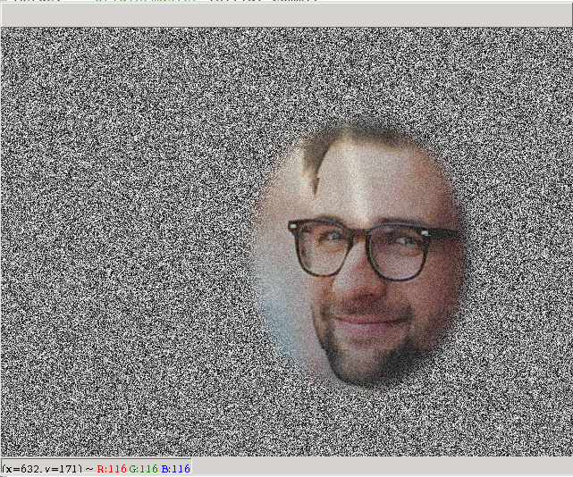

# WebCam Remove Background

A Python script to remove background of a webcam image and stream the result into a virtual video device. The background removal is based on face detection within each image.

## Requirements
- Tested with Python 3.7
- Requires [V4L2-Loopback](https://github.com/umlaeute/v4l2loopback).
  In Ubuntu this is available as the package `v4l2loopback-utils` and its dependencies. **HOWEVER** under Ubuntu 18.04 with recent Kernel, the module has a [bug](https://github.com/umlaeute/v4l2loopback/issues/172) (see [here](https://github.com/jremmons/pyfakewebcam/issues/5#issuecomment-612167782) also). Hence, it is advised to install `v4l2loopback` from github source.

## Usage
1. create a virtual video device
    ```bash
	$ sudo modprobe v4l2loopback devices=1 video_nr=20 card_label='v4l2loopback' exclusive_caps=1
	```
2. Make sure you the video device `/dev/video20` has been created.
3. Run `python removeCamBg.py`

## Command line arguments
See `python removeCamBg.py --help`.

## Example Result
Holding a newspaper in front of the camera yields these results:

Input image:


Output image:


